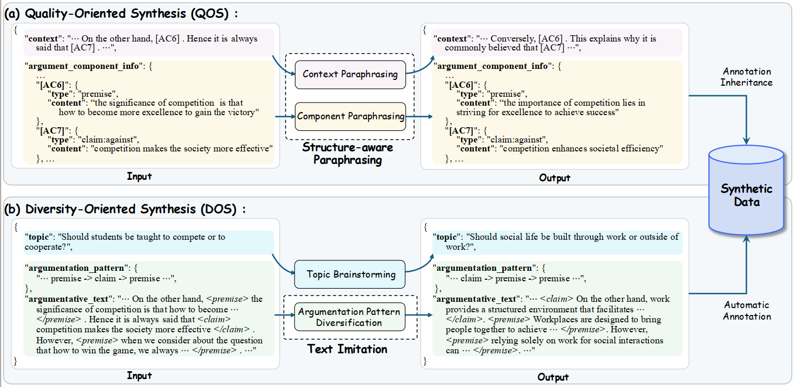

# Exploring Quality and Diversity in Synthetic Data Generation for Argument Mining

**EMNLP 2025 Main Conference**

[](https://2025.emnlp.org/)
[](https://www.python.org/)

---

## 📋 Table of Contents

- [Abstract](#abstract)
- [Framework](#framework)
- [Features](#features)
- [Project Structure](#project-structure)
- [Installation](#installation)
- [Quick Start](#quick-start)
- [Usage](#usage)
  - [Data Generation](#data-generation)
  - [Model Training](#model-training)
- [Dataset](#dataset)
- [Citation](#citation)
- [License](#license)

---

## Abstract

The advancement of Argument Mining (AM) is hindered by a critical bottleneck: the scarcity of structure-annotated datasets, which are expensive to create manually. Inspired by recent successes in synthetic data generation across various NLP tasks, this paper explores methodologies for LLMs to generate synthetic data for AM.

We investigate two complementary synthesis perspectives:

- **Quality-Oriented Synthesis (QOS)**: Employs structure-aware paraphrasing to preserve annotation quality
- **Diversity-Oriented Synthesis (DOS)**: Generates novel argumentative texts with diverse topics and argument structures

Experiments on three datasets show that augmenting original training data with our synthetic data, particularly when combining both quality- and diversity-oriented instances, significantly enhances the performance of existing AM models, both in full-data and low-resource settings.

Moreover, the positive correlation between synthetic data volume and model performance highlights the scalability of our methods.

---

## Framework

The following figure illustrates the overall framework of our QOS+DOS approach:

<div align="center">
  
</div>

*Figure: Overview of Quality-Oriented Synthesis (QOS) and Diversity-Oriented Synthesis (DOS) framework for Argument Mining.*

---

## Features

- ✨ **Dual Synthesis Approaches**: Quality-oriented (QOS) and diversity-oriented (DOS) synthetic data generation
- 🎯 **Structure-Aware**: Preserves argument structure and annotation quality
- 📊 **Multi-Dataset Support**: Compatible with AAEC, CDCP, and AbstRCT datasets
- 🚀 **Scalable**: Positive correlation between synthetic data volume and model performance
- 🔧 **Flexible Configuration**: Easy-to-adjust agent parameters and workflows
- 📈 **Low-Resource Friendly**: Effective in both full-data and few-shot settings

---

## Project Structure

```
QOS+DOS/
├── Data/                           # Generated synthetic data
│   ├── aaec_essay/
│   │   └── syn_datas/
│   │       ├── imitation_agent/    # DOS: 5% and 100% (without annotation)
│   │       └── paraphrase_agent/   # QOS: 5% and 100%
│   ├── AAEC/                      
│   ├── CDCP/                       
│   └── AbstRCT/                    
│
├── data_mrp/                       # Original datasets
│
├── graph_parser/                   # ST Model
│
└── Struct-Syn/                     # Synthetic data generation framework
    ├── src/
    │   ├── LM/                     # Language model interfaces
    │   │   ├── config.json         # LLM API configuration
    │   │   ├── abstract_language_model.py
    │   │   └── chatgpt.py
    │   └── syn_Agents/             # Synthetic data generation agents
    │       ├── Abstract_Agent.py  # Base agent class
    │       ├── Paraphrase_Agent.py # QOS: Paraphrase agent
    │       ├── Imitation_Agent.py  # DOS: Imitation agent
    │       ├── Topic_Agent.py      # Topic generation agent
    │       ├── Topic_Summary_Agent.py
    │       ├── EDA_Agent.py        # EDA (Easy Data Augmentation) agent
    │       ├── JTLS_Agent.py       # Joint topic learning agent
    │       └── utils.py            # Agent utilities
    ├── Topic_Summary.py            # Extract topics from dataset
    ├── Topic_Generate.py           # Generate additional topics
    ├── Agent_Caller.py             # Main script for data generation
    └── utils.py
```

---

## Installation
### Setup

1. **Clone the repository**
```bash
git clone git@github.com:YuqiHuang2003/Struct-Syn.git
cd QOS_DOS
```

2. **Install dependencies**
```bash
pip install -r requirements.txt
```

3. **Configure LLM API**
   
   Edit `Struct-Syn/src/LM/config.json` with your LLM API keys and base URLs:
```json
{
  "api_key": "your_api_key",
  "base_url": "your_base_URL",
  "model": "your_model_name"
}
```

---

## Quick Start

### Step 1: Extract and Generate Topics

Extract original topics from the dataset, then generate additional topics:

```bash
cd Struct-Syn
python Topic_Summary.py    # Extract topics from original dataset
python Topic_Generate.py    # Generate additional topics
```

### Step 2: Generate Synthetic Data

Generate QOS and DOS datasets. **Note**: Adjust agent parameters and workflow in the script before running.

```bash
python Agent_Caller.py
```

The generated data will be saved in `Data/{dataset_name}/syn_datas/` with separate folders for `imitation_agent` (DOS) and `paraphrase_agent` (QOS).

---

## Usage

### Data Generation

#### Quality-Oriented Synthesis (QOS)

Uses structure-aware paraphrasing to generate high-quality synthetic data:

```bash
cd Struct-Syn
python Agent_Caller.py --agent paraphrase_agent --dataset cdcp
```

#### Diversity-Oriented Synthesis (DOS)

Generates novel argumentative texts with diverse topics and structures:

```bash
cd Struct-Syn
python Agent_Caller.py --agent imitation_agent --dataset cdcp
```

### Model Training

#### 1. Train Baseline Model

Train the original ST (Structure-Tree) model on the baseline dataset:

```bash
cd graph_parser
python run_systems_datasets.py --few_shot 5 --dataset cdcp --gpu_id 0
```

**Parameters:**
- `--few_shot`: Number of training examples (e.g., 5, 10, 100)
- `--dataset`: Dataset name (`cdcp`, `aaec`, `abstrct`)
- `--gpu_id`: GPU device ID

#### 2. Auto-Annotation (DOS Only)

Automatically annotate DOS synthetic data using the trained baseline model:

```bash
python run_distill.py --gpu_id 0 --model PATH_TO_BASELINE_MODEL
```

**Note**: 
- Set `--model` to the path of your trained baseline ST model
- Dataset and few-shot settings are configured in the script

#### 3. Train with Synthetic Data

Train the model using synthetic data augmentation:

**With QOS data:**
```bash
python run_pretrain_sft_props.py --gpu_id 0 --agent paraphrase_agent --dataset cdcp --few_shot 5
```

**With DOS data:**
```bash
python run_pretrain_sft_props.py --gpu_id 0 --agent imitation_agent --dataset cdcp --few_shot 5
```

**Combined approach:**
Use both QOS and DOS data by training with each separately and then combining results, or modify the training script to use both data sources simultaneously.

---

## Dataset

This project supports three argument mining datasets:

| Dataset | Description | Source |
|---------|-------------|--------|
| **AAEC** | Argument Annotated Essays Corpus | Academic essays with argument structure annotations |
| **CDCP** | Congressional Debate Corpus | Congressional debate transcripts |
| **AbstRCT** | Abstract Argumentation Corpus | Scientific abstracts with argument relations |

Original datasets should be placed in `data_mrp/` directory in MRP format. Synthetic data will be generated in `Data/{dataset_name}/syn_datas/`.

---

## Citation

If you use this code or data in your research, please cite:

```bibtex
@inproceedings{bao2025exploring,
  title={Exploring Quality and Diversity in Synthetic Data Generation for Argument Mining},
  author={Bao, Jianzhu and Huang, Yuqi and Sun, Yang and Wang, Wenya and Zhang, Yice and Jin, Bojun and Xu, Ruifeng},
  booktitle={Proceedings of the 2025 Conference on Empirical Methods in Natural Language Processing},
  pages={26592--26615},
  year={2025}
}
```

---

## License

This project is licensed under the MIT License - see the LICENSE file for details.

---

## Contact

For questions or issues, please open an issue on GitHub or contact the authors via e-mail.

---

**Note**: This is the official implementation of the paper "Exploring Quality and Diversity in Synthetic Data Generation for Argument Mining" (EMNLP 2025 Main Conference).
